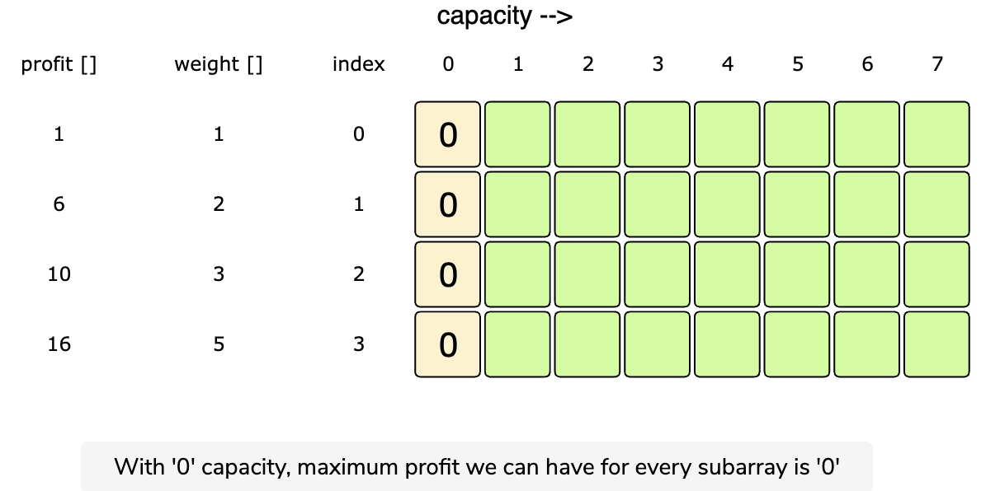

# 0/1 Knapsack Problem

In the knapsack problem, we have a set of items. Each item has a weight and a worth value. We want to put these items into a knapsack. However, it has a weight capacity limit. Our objective is to choose the items in such a way so we get the most value. Therefore, we need to choose the items whose total weight does not exceed the weight capacity, and their total value is as high as possible.

**In the 0/1 knapsack problem, each item must either be chosen or left behind. We cannot take more than one instance for each item. You cannot take fractional quantity as well. Than is why it is 0/1: you either take the whole item or you don't include it at all.**

Let’s take Merry’s example, who wants to carry some fruits in the knapsack to get maximum profit. Here are the weights and profits of the fruits:
**Items:** { Apple, Orange, Banana, Melon }
**Weights:** { 2, 3, 1, 4 }
**Profits:** { 4, 5, 3, 7 }
**Knapsack capacity:** 5

Let’s try to put different combinations of fruits in the knapsack, such that their total weight is not more than 5:

Apple + Orange (total weight 5) => 9 profit
Apple + Banana (total weight 3) => 7 profit
Orange + Banana (total weight 4) => 8 profit
Banana + Melon (total weight 5) => 10 profit

This shows that Banana + Melon is the best combination, as it gives us the maximum profit and the total weight does not exceed the capacity.

### Basic Solution

A basic brute-force solution could be to try all combinations of the given items (as we did above), allowing us to choose the one with maximum profit and a weight that doesn’t exceed ‘C.’ Take the example of four items (A, B, C, and D), as shown in the diagram below. To try all the combinations, our algorithm will look like:

```code
for each item 'i'
  create a new set which INCLUDES item 'i' if the total weight does not exceed the capacity, and
     recursively process the remaining capacity and items
  create a new set WITHOUT item 'i', and recursively process the remaining items
return the set from the above two sets with higher profit
```


All green boxes have a total weight that is less than or equal to the capacity (7), and all the red ones have a weight that is more than 7. The best solution we have is with items [B, D] having a total profit of 22 and a total weight of 7.

[Recursive Knapsack Code](../0-1-Knapsack/knapsack-recursive.js)

The above algorithm’s time complexity is exponential O(2^n), where ‘n’ represents the total number of items. This can also be confirmed from the above recursion tree. As we can see that we will have a total of ‘31’ recursive calls – calculated through (2^n) + (2^n) - 1, which is asymptotically equivalent to O(2^n).

The space complexity is O(n). This is the sapce used to store the recursion stack. Since our recursive algorithm works in a depth-first fashion, which means, we can't have more than 'n' recursive calls on the stack at any given time.

Let’s visually draw the recursive calls to see if there are any overlapping sub-problems. As we can see, in each recursive call, profits and weights arrays remain constant, and only capacity and currentIndex change. For simplicity, let’s denote capacity with ‘c’ and currentIndex with ‘i’:


We can clearly see that ‘c:4, i=3’ has been called twice even in this small input hence we have an overlapping sub-problems pattern. We can resolve this using memoization.

### Top-Down Dynamic Programming with Memoization

We can use memoization to overcome the overlapping sub-problems. To reiterate, memoization is when we store the results of all the previously solved sub-problems and return the results from memory if we encounter a problem that has already been solved.

Since we have two changing values (`capacity` and `currentIndex`) in our recursive function `knapsackRecursive()`, we can use a two-dimensional array to store the results of all the solved sub-problems. As mentioned above, we need to store results for every sub-array (i.e., for every possible index ‘i’) and for every possible capacity ‘c’.

[Code with memoiztion](../0-1-Knapsack/knapsack-recursive-memoization.js)

What is the time and space complexity of the above solution? Since our memoization array `dp[profits.length][capacity+1]` stores the results for all the subproblems, we can conclude that we will not have more than N*C subproblems (where N is the number of items and C is the knapsack capacity). This means that our time complexity will be O(N*C).

The above algorithm uses O(N*C) space for the memoization array. Other than that, we will use O(N) space for the recursion call stack. So, the total space complexity will be O(N*C + N) which is equivalent to O(N \* C)

### Bottom-Up Dynamic Programming

Let's try to populate our `dp[][]` array from the above solution, working in a bottom-up fashion. Essentially, we want to find the maximum profit for every sub-array and for every possible capacity. **This means, `dp[i][c]` will represent the maximum knapsack profit for capacity ‘c’ calculated from the first ‘i’ items.**

So, for each item at index ‘i’ (0 <= i < items.length) and capacity ‘c’ (0 <= c <= capacity), we have two options:

1. Exclude the item at index ‘i’. In this case, we will take whatever profit we get from the sub-array excluding this item => `dp[i-1][c]`

2. Include the item at index ‘i’ if its weight is not more than the capacity. In this case, we include its profit plus whatever profit we get from the remaining capacity and from remaining items => `profits[i] + dp[i-1][c-weights[i]]`

Finally, our optimal solution is the max of these two values:

```code
dp[i][c] = max (dp[i-1][c], profits[i] + dp[i-1][c-weights[i]])
```




**Code:**

[Knapsack DP Code](../0-1-Knapsack/knapsackdp.js)

The above solution has a time and space complexity of O(N \* C), where ‘N’ represents total items, and ‘C’ is the maximum capacity.

### How to find the selected items?

As we know that the final profit is at the bottom-right corner; therefore, we will start from there to find the items that will be going in the knapsack.

As you remember, at every step, we had two options: include an item or skip it. If we skip an item, then we take the profit from the remaining items (i.e., from the cell right above it); if we include the item, then we jump to the remaining profit to find more items.

Let's understand this from the above example:


1. ‘22’ did not come from the top cell (which is 17); hence we must include the item at index ‘3’ (which is the item ‘D’).

2. Subtract the profit of item ‘D’ from ‘22’ to get the remaining profit ‘6’. We then jump to profit ‘6’ on the same row.

3. ‘6’ came from the top cell, so we jump to row ‘2’.

4. Again, ‘6’ came from the top cell, so we jump to row ‘1’.

5. ‘6’ is different than the top cell, so we must include this item (which is item ‘B’).

6. Subtract the profit of ‘B’ from ‘6’ to get the profit ‘0’. We then jump to profit ‘0’ on the same row. As soon as we hit zero remaining profit, we can finish our item search.

7. So items going into the knapsack are {B, D}.

Refer to the `printItems` function in the code to see this:

[Knapsack DP Code](../0-1-Knapsack/knapsackdp.js)

## Optimizations

Can we further improve our bottom-up DP solution? Can you find an algorithm that has O(C) space complexity?

Look how at every iteration we are using values from the same row and the row above. So at any point of time while computing for row i if we only keep the value for row (i - 1), that should be enough, which means at any point of time we only need 2 rows: row i and row (i - 1).

So what we can do is, we can take a 2-D array `dp[][]` with just 2 rows, and for all rows with odd index, like index = 1, 3, and so on, we store the values in `dp[1]`, and for all rows with even indices we store values in `dp[0]`.

If n is odd, then the final answer will be at `dp[0][capacity]` and if n is even then the final answer will be at `dp[1][capacity]` because index starts from 0.

[Knapsack DP Code with 2 rows](../0-1-Knapsack/knapsackdp2rows.js)

### Even more optimization

This space optimization solution can also be implemented using a single array. It is a bit tricky though, but the intuition is to use the same array for the previous and the next iteration!

If you see closely, we need two values from the previous iteration: `dp[c]` and `dp[c-weight[i]]`

Since our inner loop is iterating over `c:0-->capacity`, let’s see how this might affect our two required values:

1. When we access `dp[c]`, it has not been overridden yet for the current iteration, so it should be fine,

2. `dp[c-weight[i]]` might be overridden if “weight[i] > 0”. Therefore we can’t use this value for the current iteration.

To solve the second case, we can change our inner loop to process in the reverse direction: `c:capacity-->0`. This will ensure that whenever we change a value in `dp[]`, we will not need it anymore in the current iteration.

[Knapsack 1 row optimized code](../0-1-Knapsack/knapsackdp1row.js)
