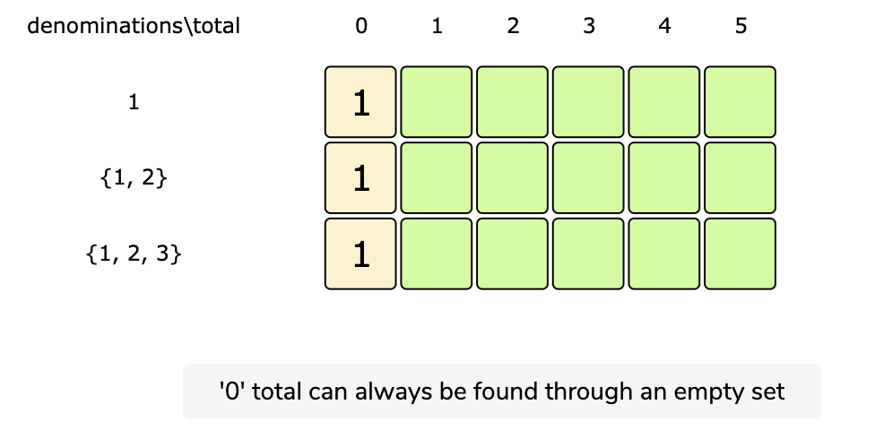
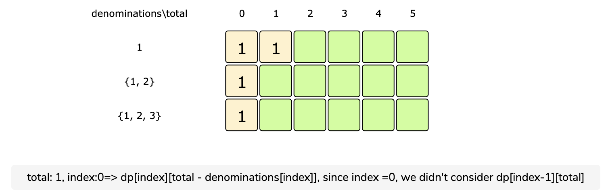
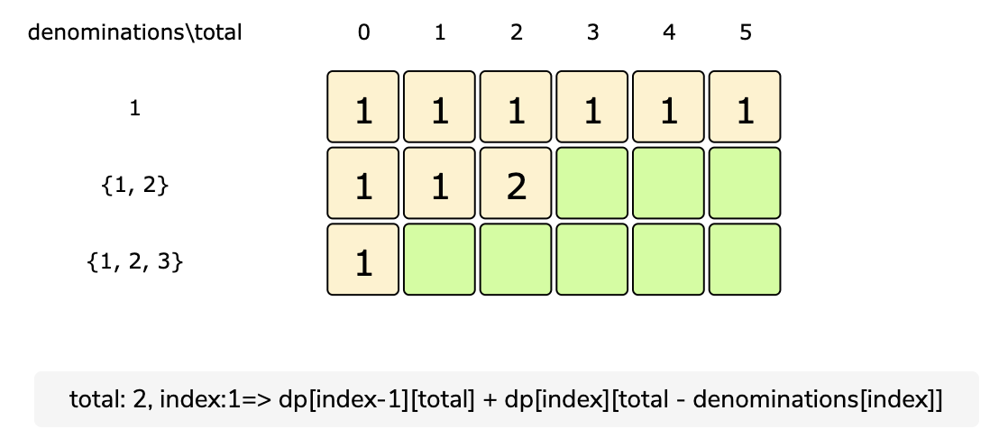
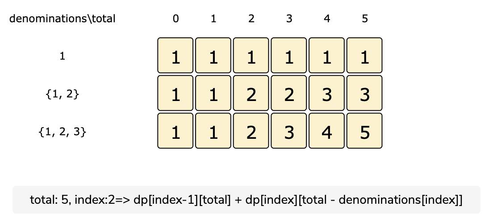

# Coin Change

Given an infinite supply of ‘n’ coin denominations and a total money amount, we are asked to find the total number of distinct ways to make up that amount.

Example:

```code
Denominations: {1,2,3}
Total amount: 5
Output: 5
Explanation: There are five ways to make the change for '5', here are those ways:
  1. {1,1,1,1,1}
  2. {1,1,1,2}
  3. {1,2,2}
  4. {1,1,3}
  5. {2,3}
```

### Solution

This problem follows the Unbounded Knapsack pattern.

A basic brute-force solution could be to try all combinations of the given coins to select the ones that give a total sum of ‘T’. This is what our algorithm will look like:

```code
for each coin 'c'
  create a new set which includes one quantity of coin 'c' if it does not exceed 'T', and
     recursively call to process all coins
  create a new set without coin 'c', and recursively call to process the remaining coins
return the count of sets who have a sum equal to 'T'
```

This problem is also quite similar to [Count of Subset Sum](./count-subset-sum.md). The only difference here is that after including the item (i.e. coin), we recursively call to process all the items (including the current coin). In 'Count of Subset Sum', however, we were recursively calling to process only the remaining items.

**Recursive Code:**

[Code](../Coin-Change/coin-change-recursive.js)

The time complexity of the above algorithm is exponential O(2^(C+T)), where ‘C’ represents total coin denominations and ‘T’ is the total amount that we want to make change. The space complexity will be O(C+T).

### Top-Down Dynamic Programming With Memoization

We can use memoization to overcome the overlapping sub-problems. We will be using a two-dimensional array to store the results of solved sub-problems

[Top Down Code](../Coin-Change/coin-change-top-down.js)

### Bottom-Up Dynamic Programming

We will try to find if we can make all possible sums, with every combination of coins, to populate the array `dp[totalDenominations][total+1]`.

So for every possible total ‘t’ (0<= t <= Total) and for every possible coin index (0 <= index < denominations.length), we have two options:

1. Exclude the coin. Count all the coin combinations without the given coin up to the total ‘t’ => `dp[index-1][t]`

2. Include the coin if its value is not more than ‘t’. In this case, we will count all the coin combinations to get the remaining total: `dp[index][t-denominations[index]]`

Finally, to find the total combinations, we will add both the above two values:

`dp[index][t] = dp[index-1][t] + dp[index][t-denominations[index]]`









**Code:**

[Bottom Up Code](../Coin-Change/coin-change-bottom-up.js)

### Space Optimized Code

[Space Optimized Code](../Coin-Change/coin-change-space-optimized.js)
