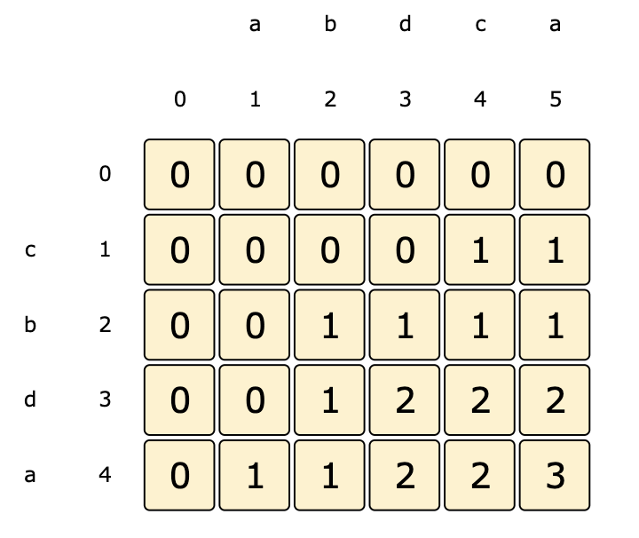

# Longest Common Subsequence

Given two strings ‘s1’ and ‘s2’, find the length of the longest subsequence which is common in both the strings.

A subsequence is a sequence that can be derived from another sequence by deleting some or no elements without changing the order of the remaining elements.

Example 1:

```code
Input: s1 = "abdca"
       s2 = "cbda"
Output: 3
Explanation: The longest common subsequence is "bda".
```

Example 2:

```code
Input: s1 = "passport"
       s2 = "ppsspt"
Output: 5
Explanation: The longest common subsequence is "psspt".
```

### Solution

A basic brute-force solution could be to try all subsequences of ‘s1’ and ‘s2’ to find the longest one. We can match both the strings one character at a time. So for every index ‘i’ in ‘s1’ and ‘j’ in ‘s2’ we must choose between:

1. If the character s1[i] matches s2[j], we can recursively match for the remaining lengths.
2. If the character s1[i] does not match s2[j], we will start two new recursive calls by skipping one character separately from each string.

[LCS Recursive Code](../Longest-Common-Subsequence/lcs-recursive.js)

The time complexity of the above algorithm is exponential O(2^(m+n)), where ‘m’ and ‘n’ are the lengths of the two input strings. The space complexity is O(m+n) which is used to store the recursion stack.

### Top-Down DP With Memoization

We can use an array to store the already solved subproblems.

The two changing values to our recursive function are the two indexes, i1 and i2. Therefore, we can store the results of all the subproblems in a two-dimensional array. (Another alternative could be to use a hash-table whose key would be a string (i1 + “|” + i2)).

[LCS Top-Down DP Code](../Longest-Common-Subsequence/lcs-top-down.js)

### Bottom-up DP

Since we want to match all the subsequences of the given two strings, we can use a two-dimensional array to store our results. The lengths of the two strings will define the size of the array’s two dimensions. So for every index ‘i’ in string ‘s1’ and ‘j’ in string ‘s2’, we will choose one of the following two options:

1. If the character `s1[i]` matches `s2[j]`, the length of the common subsequence would be one plus the length of the common subsequence till the i-1 and j-1 indexes in the two respective strings.

2. If the character `s1[i]` does not match `s2[j]`, we will take the longest subsequence by either skipping ith or jth character from the respective strings.

Recursive formula:

```code
if s1[i] == s2[j]
  dp[i][j] = 1 + dp[i-1][j-1]
else
  dp[i][j] = max(dp[i-1][j], dp[i][j-1])
```



[Bottom up Code](../Longest-Common-Subsequence/lcs-bottom-up.js)

### Space Optimization

Since we only need the previous row in our DP table to compute values for current row, we can use a 1D array instead and optimize space.

[Space Optimized DP Code](../Longest-Common-Subsequence/lcs-bottom-up-optimized.js)
