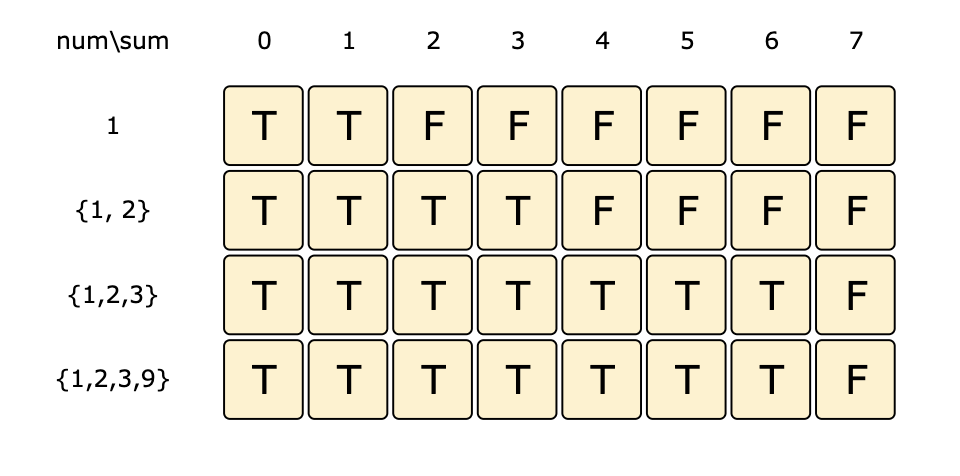

# Minimum Subset Sum Difference

Given a set of positive numbers, partition the set into two subsets with a minimum difference between their subset sums.

Example 1:

```code
Input: {1, 2, 3, 9}
Output: 3
Explanation: We can partition the given set into two subsets where the minimum absolute difference
between the sum of numbers is '3'. Following are the two subsets: {1, 2, 3} & {9}.
```

Example 2:

```code
Input: {1, 2, 7, 1, 5}
Output: 0
Explanation: We can partition the given set into two subsets where the minimum absolute difference
between the sum of numbers is '0'. Following are the two subsets: {1, 2, 5} & {7, 1}.
```

### Solution

This problem follows the 0/1 Knapsack pattern and can be converted into a Subset Sum problem.

Let’s assume S1 and S2 are the two desired subsets. A basic brute-force solution could be to try adding each element either in S1 or S2, to find the combination that gives the minimum sum difference between the two sets.

So our brute-force algorithm will look like:

```code
for each number 'i'
  add number 'i' to S1 and recursively process the remaining numbers
  add number 'i' to S2 and recursively process the remaining numbers
return the minimum absolute difference of the above two sets
```

[Recursive Code](../Minimum-Subset-Sum-Difference/min-subset-sum-diff-recursive.js)

The time complexity of the above algorithm is exponential O(2^n), where n represents the total number. The space complexity is O(n) for the recursion stack.

### Bottom Up Dynamic Programming

Let’s assume ‘S’ represents the total sum of all the numbers. So what we are trying to achieve in this problem is to find a subset whose sum is as close to ‘S/2’ as possible, because if we can partition the given set into two subsets of an equal sum, we get the minimum difference i.e. zero. This transforms our problem to Subset Sum, where we try to find a subset whose sum is equal to a given number-- ‘S/2’ in our case. If we can’t find such a subset, then we will take the subset which has the sum closest to ‘S/2’. This is easily possible, as we will be calculating all possible sums with every subset.

Essentially, we need to calculate all the possible sums up to ‘S/2’ for all numbers. So how do we populate the array `dp[TotalNumbers][s/2+1]` in the bottom-up fashion?

For every possible sum ‘s’ (where 0 <= s <= S/2), we have two options:

1. Exclude the number. In this case, we will see if we can get the sum ‘s’ from the subset excluding this number => `dp[index-1][s]`

2. Include the number if its value is not more than ‘s’. In this case, we will see if we can find a subset to get the remaining sum => `dp[index-1][s-num[index]]`

If either of the two above scenarios is true, we can find a subset with a sum equal to ‘s’. We should dig into this before we can learn how to find the closest subset.

Let’s draw this visually, with the example input {1, 2, 3, 9}. Since the total sum is ‘15’, therefore, we will try to find a subset whose sum is equal to the half of it i.e. ‘7’.

The dp table for this would look like:



The above visualization tells us that it is not possible to find a subset whose sum is equal to ‘7’. So what is the closest subset we can find? We can find such a subset if we start moving backward in the last row from the bottom right corner to find the first ‘T’. The first “T” in the above diagram is the sum ‘6’, which means we can find a subset whose sum is equal to ‘6’. This means the other set will have a sum of ‘9’, and the minimum difference will be ‘3’.

[Bottom Up Code](../Minimum-Subset-Sum-Difference/min-subset-sum-bottom-up.js)

### Space Optimization

Just like other 0/1 Knapsack problems, we can optimize this for space and just use a 1D array.

[Space Optimized Code](../Minimum-Subset-Sum-Difference/min-subset-sum-dp.js)
