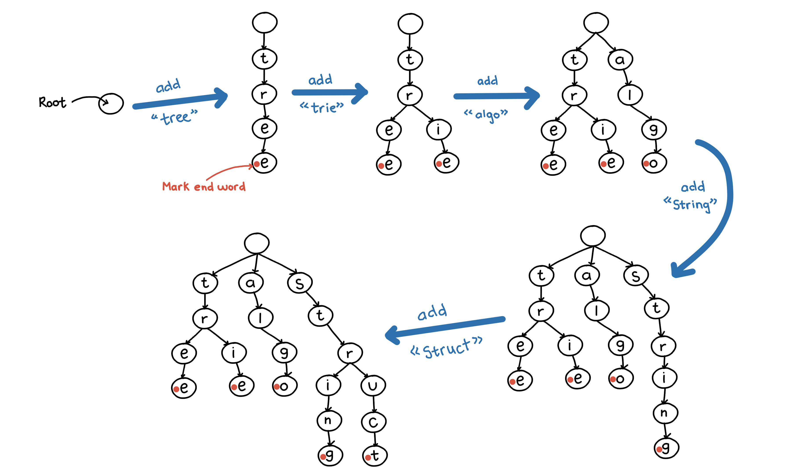

# Trie

A trie, also known as a prefix tree, is an n-ary tree used for locating specific keys from withing a set. It's nodes store the letters of an alphabet and point to multiple child nodes. In order to access a key (to recover it's value, change it or remove it), the trie is traversed depth first. The two most important uses of Trie are:

1. Given a dictionary and given a prefix, search if there is one or more words in the dictionary starting with the same prefix.
   **If the length of the prefix is M, the time complexity of this operation would be O(M).**

2. Given a dictionary and given a word, search if the dictionary contains the word.
   **If the length of the word is M, the time complexity of the operation is O(M)**

Below is the process to build a trie containing the words “tree”, “trie”, “algo”, “string” and “struct”.

**Code Implementation:**

**Functionalities:**

`addWord`: adds a given word to the dictionary

`removeWord`: removes a word from the dictionary

`find`: finds number of words present in the dictionary with a given prefix

`numWords`: number of words present in the dictionary

`printWordsWithPrefix`: prints words with a given prefix

`isWord`: determine if a word is present in the dictionary

`isPrefix`: determine if a string is a prefix to any word in the dictionary. Remember that a word is also a prefix of itself.
