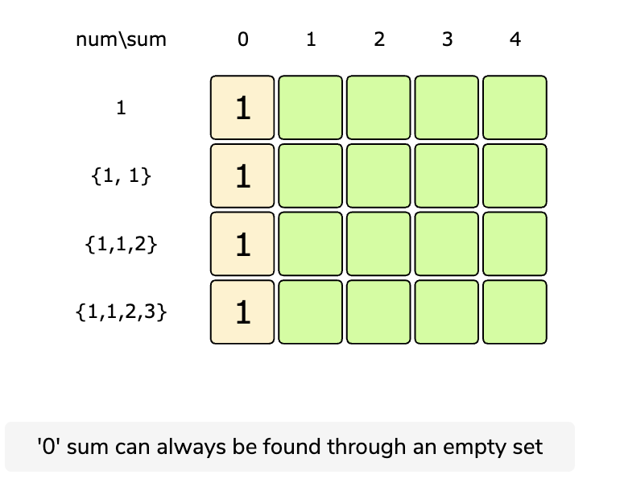
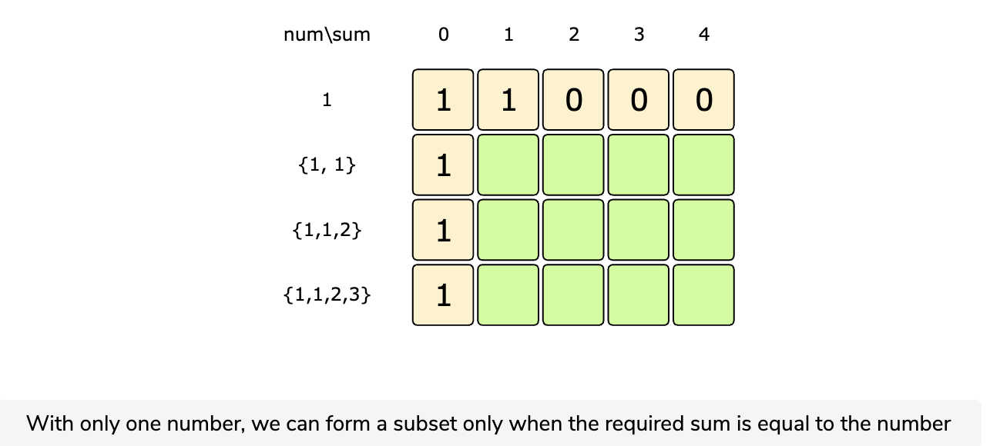
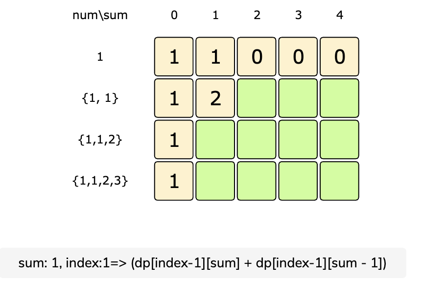
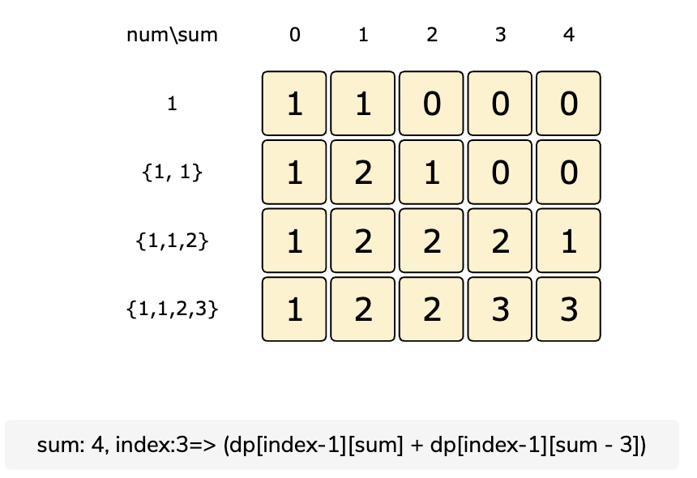

# Count Subset Sum

Given an array of positive numbers, find the total number of subsets whose sum is equal to a given number ‘S’.

Example 1:

```text
Input: [1, 1, 2, 3], S=4
Output: 3
The given set has '3' subsets whose sum is '4': {1, 1, 2}, {1, 3}, {1, 3}
Note that we have two similar sets {1, 3}, because we have two '1' in our input.
```

Example 2:

```text
Input: {1, 2, 7, 1, 5}, S=9
Output: 3
The given set has '3' subsets whose sum is '9': {2, 7}, {1, 7, 1}, {1, 2, 1, 5}
```

## Solution

This is similar to the Subset Sum problem. Basically, it's the same problem with the only difference that instead of returning whether there exists at least one subset with desired sum, we compute all such subsets.

We wil start with the code of Subset Sum Problem and will show how to transform the same code to achieve our end goal for this problem.

```javascript
let canPartition = function (num, sum) {
  const n = num.length;

  const dp = Array(n)
    .fill(false)
    .map(() => Array(sum + 1).fill(false));

  // populate the sum=0 column, as we can always have '0' sum without including any element
  for (let i = 0; i < n; i++) dp[i][0] = true;

  // with only one number, we can form a subset only when the required sum is equal to its value
  for (let s = 1; s <= sum; s++) {
    dp[0][s] = num[0] == s;
  }

  // process all subsets for all sums
  for (let i = 1; i < n; i++) {
    for (let s = 1; s <= sum; s++) {
      // if we can get the sum 's' without the number at index 'i'
      if (dp[i - 1][s]) {
        dp[i][s] = dp[i - 1][s];
      } else if (s >= num[i]) {
        // else if we can find a subset to get the remaining sum
        dp[i][s] = dp[i - 1][s - num[i]];
      }
    }
  }

  // the bottom-right corner will have our answer.
  return dp[n - 1][sum];
};
```

The only change we need to make is it to change our dp array from storing booleans to storing the count of subset sums at that index. So `dp[i][j]` represents the count of subset sums with the first i items and the sum j.

When looping through the items and upto the sum, `dp[i][j]` is equal to the count of subset sum we get by excluding the current item from the set + the count of subset sum by including the item in the set.

The code for the bottom up approach:

[Count of Subset Sum Bottom Up](https://github.com/vedantb/DP-Interviews/tree/746642c4896349114c442abf9ed439d6490a8193/Count-Subset-Sum/count-subset-sum.js)

The following illustrations better help understand the DP table we store:









## Space Optimization

Like in other problems of the 0/1 Knapsack Type, we can optimize space and just have a 1D array.

[Count Subset Sum Space Optimized Code](https://github.com/vedantb/DP-Interviews/tree/746642c4896349114c442abf9ed439d6490a8193/Count-Subset-Sum/count-subset-sum-optimized.js)

