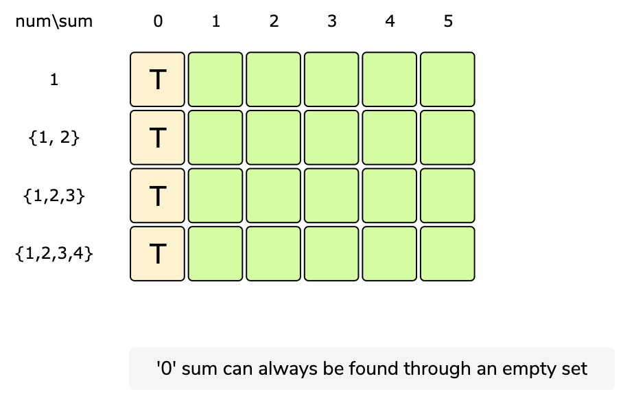
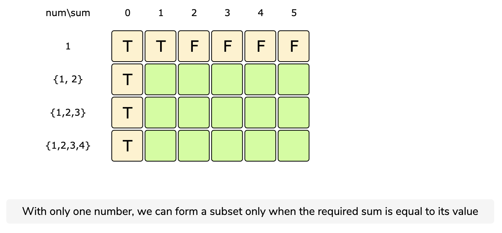
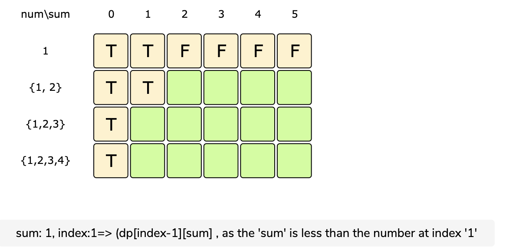
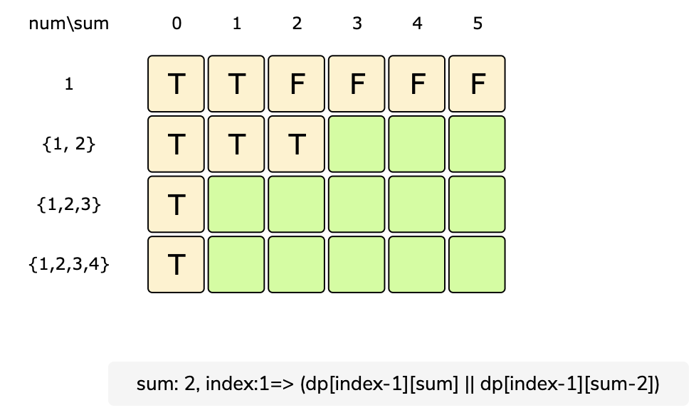
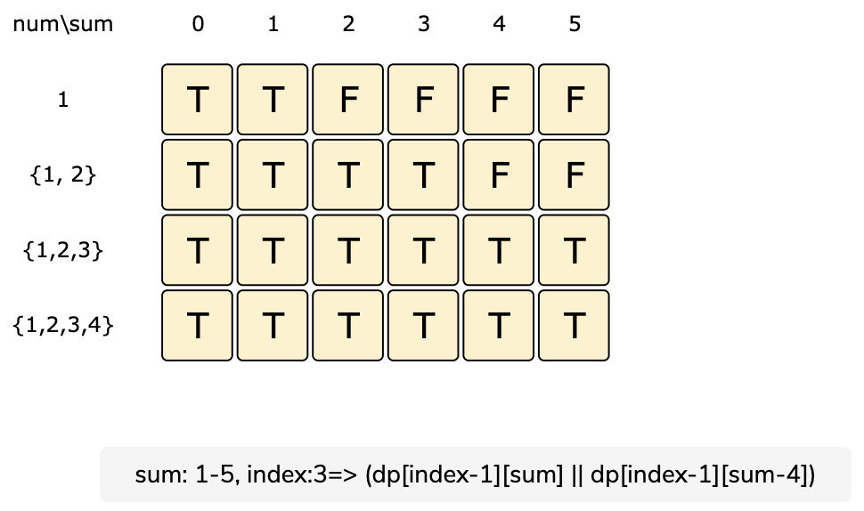

# Equal Subset Sum Partition

Given a set of positive numbers, find if we can partition it into two subsets such that the sum of elements in both the subsets is equal.

Example 1:

```text
Input: {1, 2, 3, 4}
Output: True
Explanation: The given set can be partitioned into two subsets with equal sum: {1, 4} & {2, 3}
```

Example 2:

```text
Input: {2, 3, 4, 6}
Output: False
Explanation: The given set cannot be partitioned into two subsets with equal sum.
```

## Basic Solution

This problem follows the 0/1 Knapsack pattern. A basic brute-force solution could be to try all combinations of partitioning the given numbers into two sets to see if any pair of sets has an equal sum.

Assume if `S` represents the total sum of all the given numbers, then the two equal subsets must have a sum equal to `S/2`. This essentially transforms our problem to: "Find a subset of the given numbers that has a total sum of S/2".

So our brute-force algorithm will look like:

```text
for each number 'i'
  create a new set which INCLUDES number 'i' if it does not exceed 'S/2', and recursively
      process the remaining numbers
  create a new set WITHOUT number 'i', and recursively process the remaining items
return true if any of the above sets has a sum equal to 'S/2', otherwise return false
```

[Equal Sum Subset Partition Recursive Code](https://github.com/vedantb/DP-Interviews/tree/746642c4896349114c442abf9ed439d6490a8193/Equal-Subset-Sum-Partition/equal-subset-sum-partition-recursive.js)

The time complexity of the above algorithm is exponential O\(2^n\), where ‘n’ represents the total number. The space complexity is O\(n\), this memory which will be used to store the recursion stack.

## Top-down Dynamic Programming with Memoization

We can use memoization to overcome the overlapping sub-problems. As stated in previous lessons, memoization is when we store the results of all the previously solved sub-problems return the results from memory if we encounter a problem that has already been solved.

Since we need to store the results for every subset and for every possible sum, therefore we will be using a two-dimensional array to store the results of the solved sub-problems. The first dimension of the array will represent different subsets and the second dimension will represent different ‘sums’ that we can calculate from each subset. These two dimensions of the array can also be inferred from the two changing values \(`sum` and `currentIndex`\) in our recursive function `canPartitionRecursive()`.

[Equal Subet Sum Partition With Memoization](https://github.com/vedantb/DP-Interviews/tree/746642c4896349114c442abf9ed439d6490a8193/Equal-Subset-Sum-Partition/equal-subset-sum-partition-memoization.js)

The above algorithm has time and space complexity of O\(N\*S\), where ‘N’ represents total numbers and ‘S’ is the total sum of all the numbers.

## Bottom-up Dynamic Programming

Let’s try to populate our `dp[][]` array from the above solution, working in a bottom-up fashion. Essentially, we want to find if we can make all possible sums with every subset. **This means, `dp[i][s]` will be ‘true’ if we can make sum ‘s’ from the first ‘i’ numbers**.

So, for each number at index ‘i’ \(0 &lt;= i &lt; num.length\) and sum ‘s’ \(0 &lt;= s &lt;= S/2\), we have two options:

1. Exclude the number. In this case, we will see if we can get ‘s’ from the subset excluding this number: `dp[i-1][s]`
2. Include the number if its value is not more than ‘s’. In this case, we will see if we can find a subset to get the remaining sum: `dp[i-1][s-num[i]]`

If either of the two above scenarios is true, we can find a subset of numbers with a sum equal to ‘s’.











From the above visualization, we can clearly see that it is possible to partition the given set into two subsets with equal sums, as shown by bottom-right cell: `dp[3][5] => T`

[Bottom Up Code](https://github.com/vedantb/DP-Interviews/tree/746642c4896349114c442abf9ed439d6490a8193/Equal-Subset-Sum-Partition/equal-subset-sum-partition-bottom-up.js)

The above solution has time and space complexity of O\(N\*S\), where ‘N’ represents total numbers and ‘S’ is the total sum of all the numbers.

## Optimized Bottom Up Solution

The solution can be optimized to have just one row in the DP table. See the [0/1 Knapsack](0-1knapsack.md) notes to read more.

[Optimized DP Code](https://github.com/vedantb/DP-Interviews/tree/746642c4896349114c442abf9ed439d6490a8193/Equal-Subset-Sum-Partition/equal-subset-sum-partition-dp.js)

### Alternative Problems

This is exactly the same as the subset sum problem which states that:

Given a set of non-negative integers, and a value sum, determine if there is a subset of the given set with sum equal to given sum.

