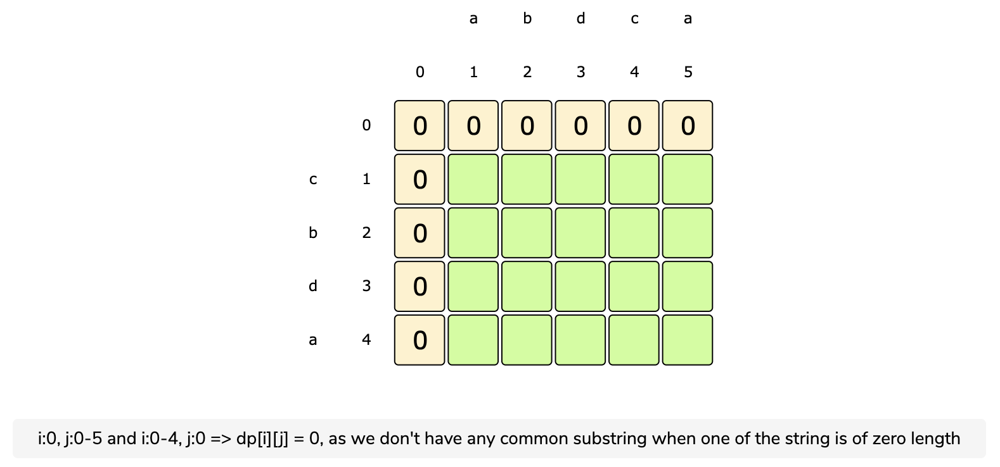
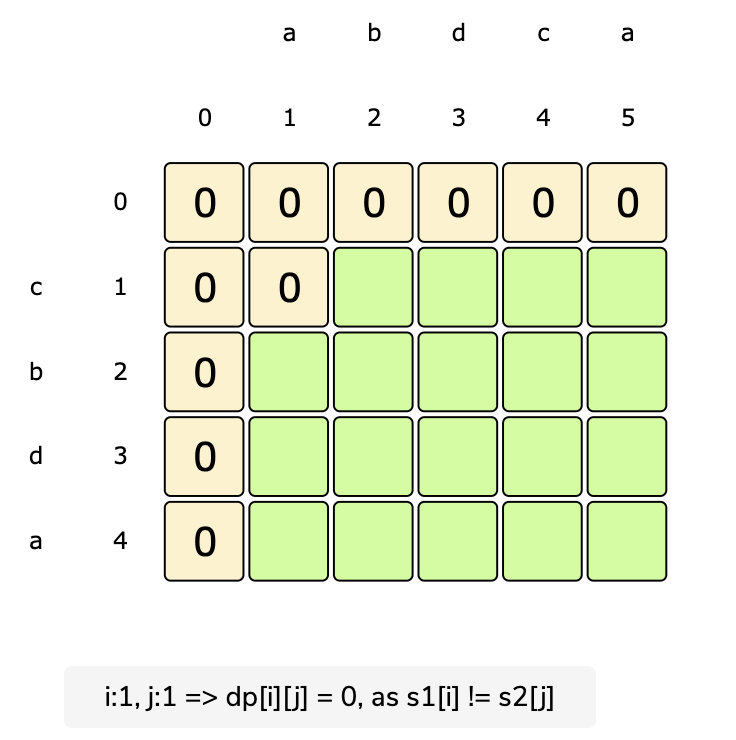
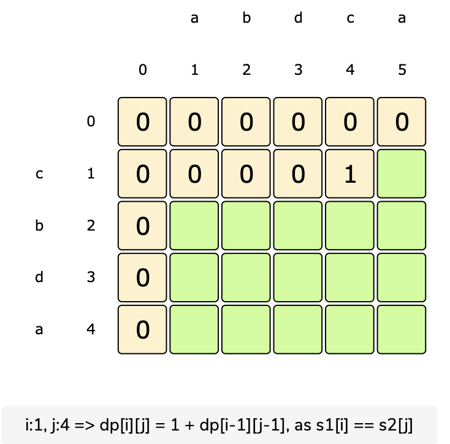
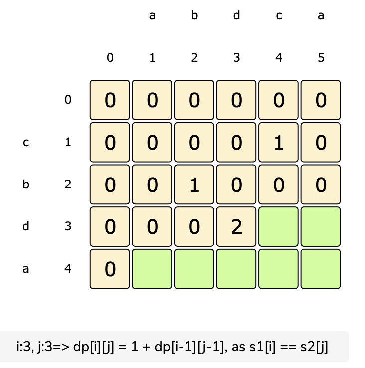
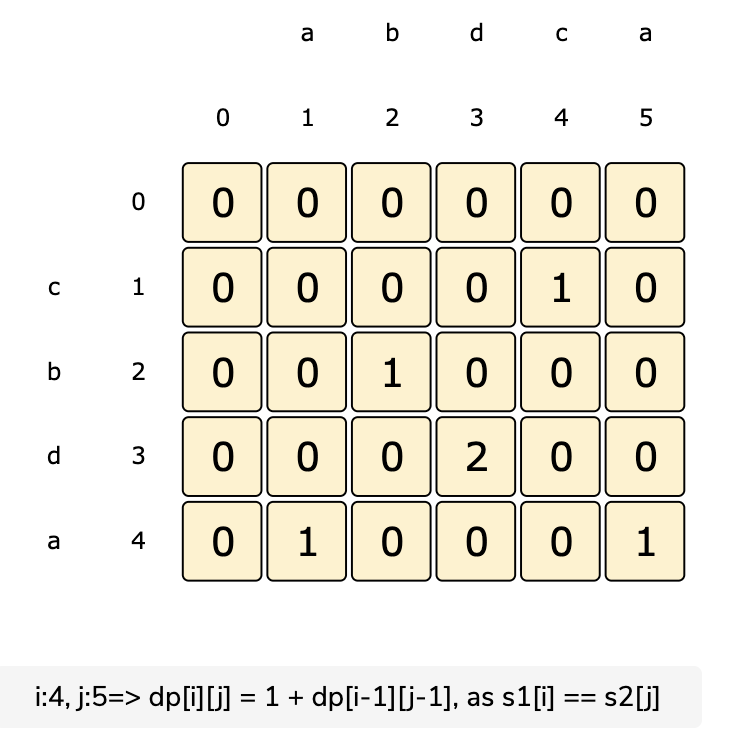

# Longest Common Substring

Given two strings ‘s1’ and ‘s2’, find the length of the longest substring which is common in both the strings.

Example 1:

```text
Input: s1 = "abdca"
       s2 = "cbda"
Output: 2
Explanation: The longest common substring is "bd".
```

Example 2:

```text
Input: s1 = "passport"
       s2 = "ppsspt"
Output: 3
Explanation: The longest common substring is "ssp".
```

## Solution

A basic brute-force solution could be to try all substrings of ‘s1’ and ‘s2’ to find the longest common one. We can start matching both the strings one character at a time, so we have two options at any step:

1. If the strings have a matching character, we can recursively match for the remaining lengths and keep a track of the current matching length.
2. If the strings don’t match, we start two new recursive calls by skipping one character separately from each string and reset the matching length.

The length of the Longest Common Substring \(LCS\) will be the maximum number returned by the three recurse calls in the above two options.

[Brute Force Code](https://github.com/vedantb/DP-Interviews/tree/746642c4896349114c442abf9ed439d6490a8193/Longest-Common-Substring/lcs-brute-force.js)

Because of the 3 recursive calls, the complexity of this algorithm is O\(3^\(m+n\)\), where 'm' and 'n' are the lengths of 2 input strings. The space complexity is O\(m + n\) which is used to store the recursion stack.

## Top-Down DP With Memoization

We can use an array to store the already solved subproblems.

The three changing values to our recursive function are the two indexes \(i1 and i2\) and the ‘count’. Therefore, we can store the results of all subproblems in a three-dimensional array. \(Another alternative could be to use a hash-table whose key would be a string \(i1 + “\|” i2 + “\|” + count\)\).

[Top Down Code](https://github.com/vedantb/DP-Interviews/tree/746642c4896349114c442abf9ed439d6490a8193/Longest-Common-Substring/lcs-top-down.js)

## Bottom-Up DP

Since we want to match all the substrings of the given two strings, we can use a two-dimensional array to store our results. The lengths of the two strings will define the size of the two dimensions of the array. So for every index ‘i’ in string ‘s1’ and ‘j’ in string ‘s2’, we have two options:

1. If the character at s1\[i\] matches s2\[j\], the length of the common substring would be one plus the length of the common substring till i-1 and j-1 indexes in the two strings.
2. If the character at the s1\[i\] does not match s2\[j\], we don’t have any common substring.

So, our recursive formula:

```text
if s1[i] == s2[j]
  dp[i][j] = 1 + dp[i-1][j-1]
else
  dp[i][j] = 0
```











**Code:**

[Bottom Up Code](https://github.com/vedantb/DP-Interviews/tree/746642c4896349114c442abf9ed439d6490a8193/Longest-Common-Substring/lcs-bottom-up.js)

The time and space complexity of this is O\(m\*n\), where 'm' and 'n' are the lengths of the input strings.

## Space Optimized Bottom Up Code

[Space Optimized Code](https://github.com/vedantb/DP-Interviews/tree/746642c4896349114c442abf9ed439d6490a8193/Longest-Common-Substring/lcs-space-optimized.js)

