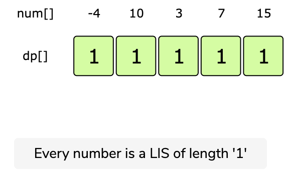
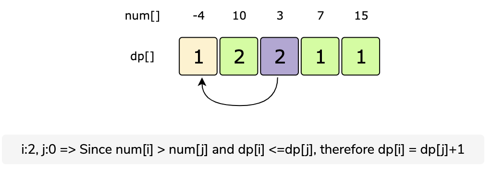
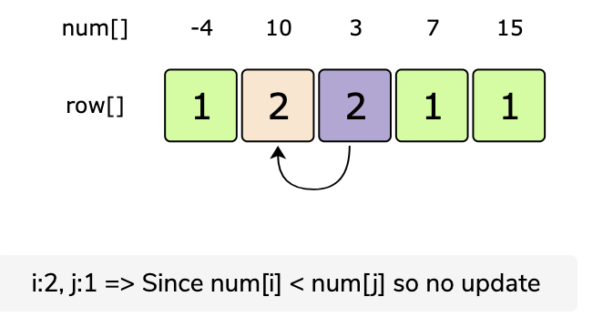
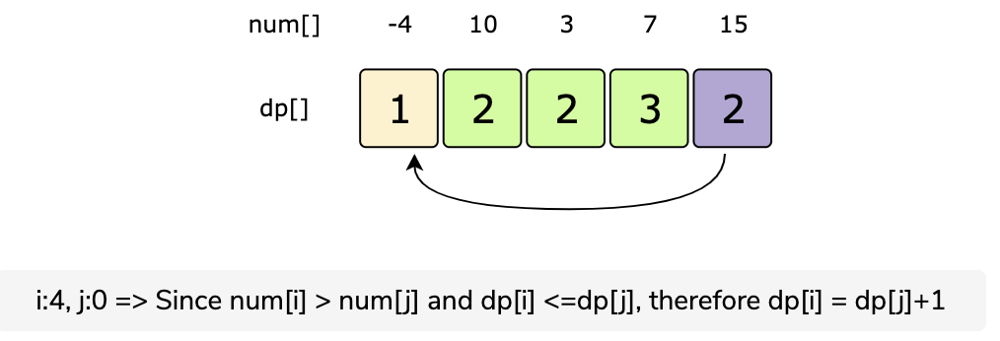
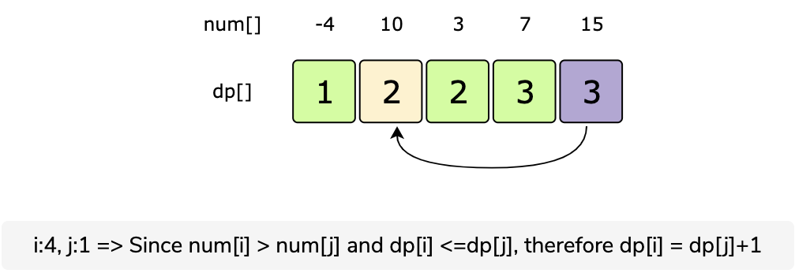
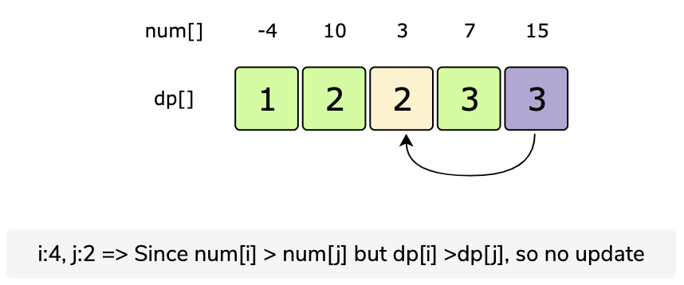
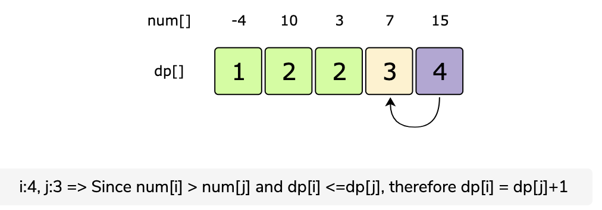

# Longest Increasing Subsequence

Given a number sequence, find the length of its Longest Increasing Subsequence \(LIS\). In an increasing subsequence, all the elements are in increasing order \(from lowest to highest\).

Example 1:

```text
Input: {4,2,3,6,10,1,12}
Output: 5
Explanation: The LIS is {2,3,6,10,12}.
```

Example 2:

```text
Input: {-4,10,3,7,15}
Output: 4
Explanation: The LIS is {-4,3,7,15}.
```

## Solution

A basic brute-force solution could be to try all the subsequences of the given sequence. We can process one number at a time, so we have two options at any step:

1. If the current number is greater than the previous number that we included, we can increment our count and make a recursive call for the remaining array.
2. We can skip the current number to make a recursive call for the remaining array.

The length of the longest increasing subsequence will be the maximum number returned by the two recurse calls from the above two options.

[Recursive Code](https://github.com/vedantb/DP-Interviews/tree/746642c4896349114c442abf9ed439d6490a8193/Longest-Increasing-Subsequence/lis-recursive.js)

The time complexity of the above algorithm is exponential O\(2^n\), where 'n' is the lengths of the input array. The space complexity is O\(n\) which is used to store the recursion stack.

## Top-Down Dynamic Programming with Memoization

To overcome the overlapping subproblems, we can use an array to store the already solved subproblems.

The two changing values for our recursive function are the current and the previous index. Therefore, we can store the results of all subproblems in a two-dimensional array. \(Another alternative could be to use a hash-table whose key would be a string \(currentIndex + “\|” + previousIndex\)\).

[Top Down Code](https://github.com/vedantb/DP-Interviews/tree/746642c4896349114c442abf9ed439d6490a8193/Longest-Increasing-Subsequence/lis-top-down.js)

**What is the time and space complexity of this solution?**

Since our memoization array `dp[nums.length][nums.length]` stores the results of all subproblems, we can conclude that we will not have more than N\*N subproblems. This means our complexity will be O\(N^2\).

## Bottom-up Dynamic Programming

The above algorithm tells us two things:

1. If the number at the current index is bigger than the number at the previous index, we increment the count for LIS up to the current index.
2. But if there is a bigger LIS without including the number at the current index, we take that.

So we need to find all the increasing subsequences for the number at index ‘i’, from all the previous numbers \(i.e. number till index ‘i-1’\), to eventually find the longest increasing subsequence.

If ‘i’ represents the ‘currentIndex’ and ‘j’ represents the ‘previousIndex’, our recursive formula would look like:

`if(num[i] > num[j]): dp[i] = dp[j] + 1 if there is no bigger LIS for 'i'`

Let’s draw this visually for {-4,10,3,7,15}. Start with a subsequence of length ‘1’, as every number will be a LIS of length ‘1’:
















**Code:**

[Bottom Up Code](https://github.com/vedantb/DP-Interviews/tree/746642c4896349114c442abf9ed439d6490a8193/Longest-Increasing-Subsequence/lis-bottom-up.js)

The time complexity is O\(N^2\) and space complexity is O\(n\).

## Tracking the Path

Now we will concentrate on printing the longest increasing subsequence. This is how we achieve this: for every element in the array we keep track of the element that comes immediately before it in the longest increasing subsequence. We store this in the parent\[\] array. Initially everyone is their own parent.

Look at the `findListLengthAndPrintPath` fuction in the bottom up code to see how the bottom up solution is modified to print the path as well.

## Use Cases

Most problems where `you are given an array (or list) of items and you'd have to find the largest subset of the items which maintains certain condition` could be solved using Longest Increasing Subsequence technique.

Template:

```javascript
function solve(nums) {
  let len = nums.length;
  let dp = Array(len).fill(APPROPRIATE_INITIAL_VALUE); //depends on the problem
  let max = 1;
  for (let i = 1; i < len; i++) {
    for (let j = 0; j < i; j++) {
    // implementation of condition method will vary according to the given problem statement
      if (condition(nums[i], nums[j])) {
          // SOME VALUE will vary depending on the problem
          dp[i] = Math.max(dp[i], dp[j] + SOME VALUE FOR I  )
      }
    }
    max = Math.max(max, dp[i]);
  }
  return max;
}
```

## Super Optimized Patience Sort

Patience Sort is an efficient way to compute the LIS in O\(nlogn\).

A great explanation is available here - [https://www.youtube.com/watch?v=22s1xxRvy28&t=2s](https://www.youtube.com/watch?v=22s1xxRvy28&t=2s)

[LIS USING PATIENCE SORT](https://github.com/vedantb/DP-Interviews/tree/746642c4896349114c442abf9ed439d6490a8193/Longest-Increasing-Subsequence/lis-patience-sort.js)

