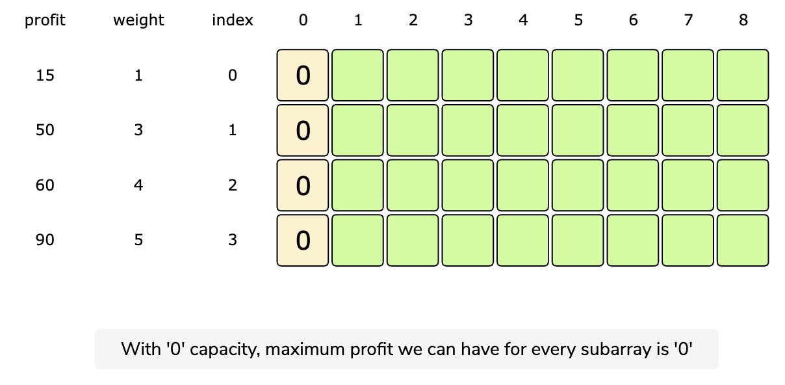
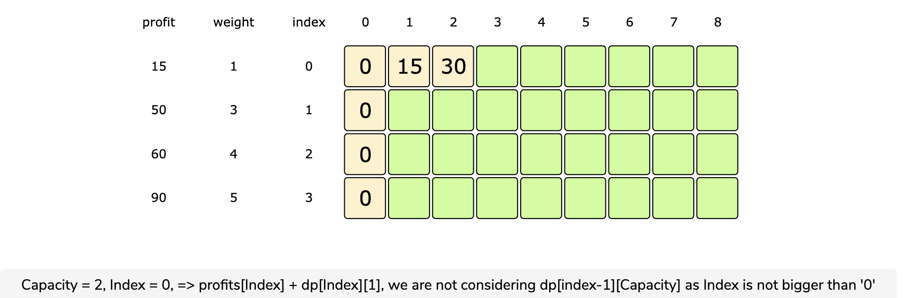
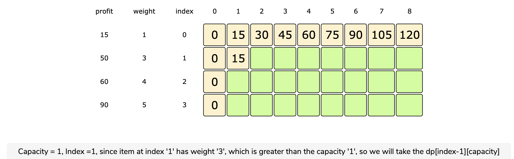
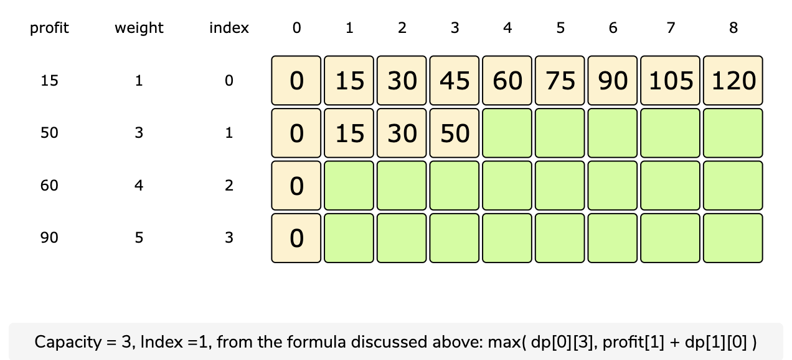
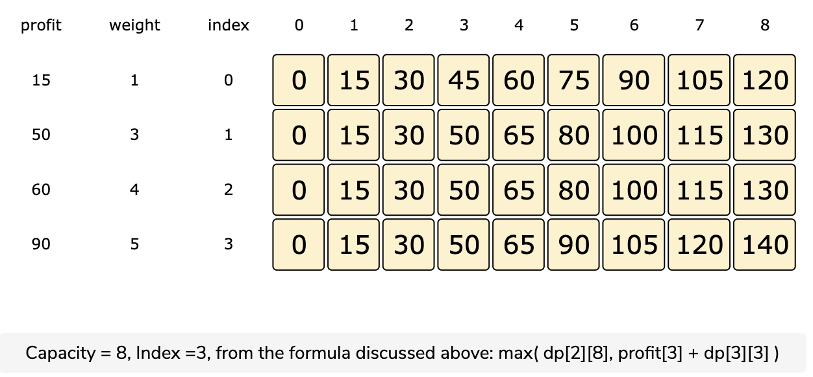
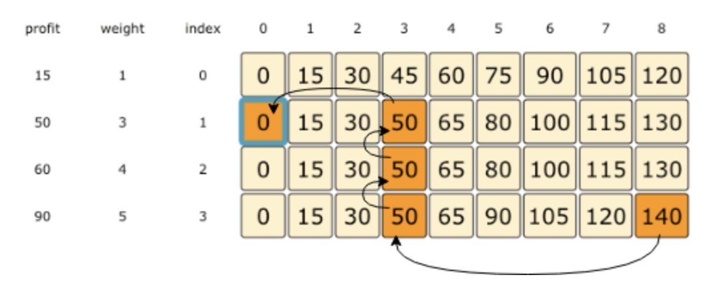

# Unbounded Knapsack

Given the weights and profits of "N" items, we are asked to put these items in a knapsack that has a capacity 'C'. The goal is to get the maximum profit from the items in the knapsack. The only difference between the 0/1 knapsack problem and this problem is that we are allowed to use an unlimited quantity of an item.

Let’s take the example of Merry, who wants to carry some fruits in the knapsack to get maximum profit. Here are the weights and profits of the fruits:

**Items:** { Apple, Orange, Melon } **Weights:** { 1, 2, 3 } **Profits:** { 15, 20, 50 } **Knapsack capacity:** 5

Let’s try to put different combinations of fruits in the knapsack, such that their total weight is not more than 5.

5 Apples \(total weight 5\) =&gt; 75 profit

1 Apple + 2 Oranges \(total weight 5\) =&gt; 55 profit

2 Apples + 1 Melon \(total weight 5\) =&gt; 80 profit

1 Orange + 1 Melon \(total weight 5\) =&gt; 70 profit

This shows that **2 apples + 1 melon** is the best combination, as it gives us the maximum profit and the total weight does not exceed the capacity.

## Basic Solution

A basic brute-force solution could be to try all combinations of the given items to choose the one with maximum profit and a weight that doesn’t exceed ‘C’. This is what our algorithm will look like:

```text
for each item 'i'
  create a new set which includes one quantity of item 'i' if it does not exceed the capacity, and
     recursively call to process all items
  create a new set without item 'i', and recursively process the remaining items
return the set from the above two sets with higher profit
```

The only difference between the 0/1 Knapsack problem and this one is that, after including the item, we recursively call to process all the items \(including the current item\). In 0/1 Knapsack, however, we recursively call to process the remaining items.

[Recursive Code](https://github.com/vedantb/DP-Interviews/tree/746642c4896349114c442abf9ed439d6490a8193/Unbounded-Knapsack/unbounded-knapsack-recursive.js)

The time complexity of the above algorithm is exponential O\(2^\(N+C\)\), where ‘N’ represents the total number of items. The space complexity is O\(N + C\) to store the recursion stack.

## Top-Down Dynamic Programming With Memoization

Once again, we can use memoization to overcome the overlapping sub-problems.

We will be using a two-dimensional array to store the results of solved sub-problems. We need to store results for every sub-array and for every possible capacity. Here is the code:

We can convert our recursive code to use memoization by changing just a few lines.


**What is the time and space complexity of the above solution?**

Since our memoization array `dp[profits.length][capacity+1]` stores the results for all the subproblems, we can conclude that we will not have more than N\*C subproblems. \(where ‘N’ is the number of items and ‘C’ is the knapsack capacity\). This means that our time complexity will be O\(N\*C\).

The above algorithm will use O\(N\*C\) space for the memoization array. Other than that we will use O\(N\) space for the recursion call stack. So the total space complexity will be O\(N\*C + N\), which is asymptotically equivalent to O\(N\*C\).

## Bottom-Up Dynamic Programming

Let’s try to populate our `dp[][]` array from the above solution, working in a bottom-up fashion. Essentially, what we want to achieve is: “Find the maximum profit for every sub-array and for every possible capacity”.

So for every possible capacity ‘c’ \(0 &lt;= c &lt;= capacity\), we have two options:

1. Exclude the item. In this case, we will take whatever profit we get from the sub-array excluding this item: `dp[index-1][c]`
2. Include the item if its weight is not more than the ‘c’. In this case, we include its profit plus whatever profit we get from the remaining capacity: `profit[index] + dp[index][c-weight[index]]`

Finally, we have to take the maximum of the above two values:

`dp[index][c] = max (dp[index-1][c], profit[index] + dp[index][c-weight[index]])`











**Code:**

[Bottom Up Code](https://github.com/vedantb/DP-Interviews/tree/746642c4896349114c442abf9ed439d6490a8193/Unbounded-Knapsack/unbounded-knapsack-bottom-up.js)

The above solution has time and space complexity of O\(N\*C\), where ‘N’ represents total items and ‘C’ is the maximum capacity.

## Find the Selected Items

As we know, the final profit is at the right-bottom corner; hence we will start from there to find the items that will be going to the knapsack.

As you remember, at every step we had two options: include an item or skip it. If we skip an item, then we take the profit from the cell right above it; if we include the item, then we jump to the remaining profit to find more items.

Let’s assume the four items are identified as {A, B, C, and D}, and use the above example to better understand this:

1. ‘140’ did not come from the top cell \(which is 130\); hence we must include the item at index ‘3’, which is ‘D’.
2. Subtract the profit of ‘D’ from ‘140’ to get the remaining profit ‘50’. We then jump to profit ‘50’ on the same row.
3. ‘50’ came from the top cell, so we jump to row ‘2’.
4. Again, ‘50’ came from the top cell, so we jump to row ‘1’.
5. ‘50’ is different than the top cell, so we must include this item, which is ‘B’.
6. Subtract the profit of ‘B’ from ‘50’ to get the remaining profit ‘0’. We then jump to profit ‘0’ on the same row. As soon as we hit zero remaining profit, we can finish our item search.
7. So items going into the knapsack are {B, D}.



Look at the `printItems` function in the bottom up code listed above.

## Space Optimized

Like the 0/1 Knapsack problem, we can optimize the space to use a 1D array. We only depend on the values of the current row and the row before the current row. This can be optimized in a 1D array exactly like the 0/1 Knapsack problem space optimization.

[Space Optimized Code](https://github.com/vedantb/DP-Interviews/tree/746642c4896349114c442abf9ed439d6490a8193/Unbounded-Knapsack/unbounded-knapsack-optimized.js)

